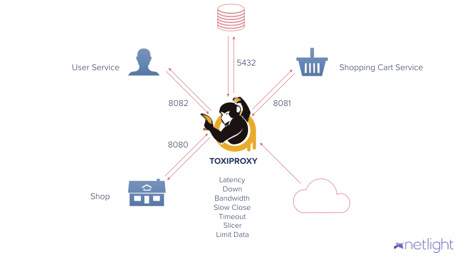

## Introducing Toxiproxy

Toxiproxy is a proxy from shopify to inject failures.

So we will do in this szenario.

Let's spin up our webshop with toxiproxy:

First checkout out the toxiproxy branch:
`git checkout steps/3-toxiproxy`{{execute}}

Then start the application again:
`docker-compose up`{{execute}}